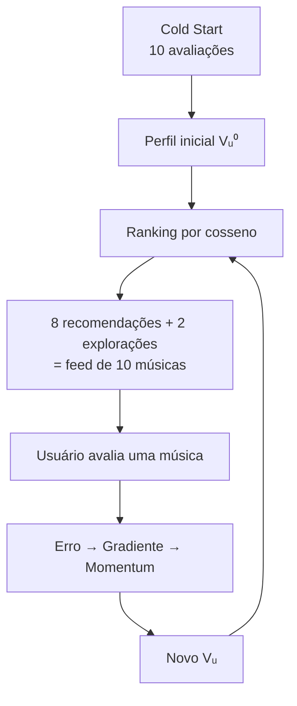
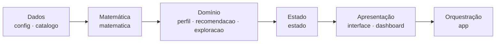

<div align="center">

# 🎧 SpotTube

### Vector Recommender & Optimization of Feedback

**Seu gosto musical, modelado por vetores.**

Sistema web de recomendação musical que aprende o gosto do usuário com **Álgebra Linear** e **Cálculo**: vetores em ℝ¹⁰, similaridade por cosseno, gradiente descendente com momentum e exploração dirigida anti-bolha.

<br>

[](https://spottube.vercel.app/)
[](https://github.com/ohenriquesilva/SpotTube)


📚 Projeto **A3** de **Cálculo e Álgebra Linear** · Engenharia de Software · **Universidade Anhembi Morumbi**

</div>

---

## 📑 Sumário

- [🎯 Objetivo](#-objetivo)
- [🚀 Acesse e execute](#-acesse-e-execute)
- [🧠 Como funciona](#-como-funciona)
- [🧮 A matemática por trás](#-a-matemática-por-trás)
- [🧭 Exploração anti-bolha](#-exploração-anti-bolha)
- [📊 HUD e Dashboard](#-hud-e-dashboard)
- [🗂️ Estrutura do projeto](#️-estrutura-do-projeto)
- [🏗️ Arquitetura](#️-arquitetura)
- [✅ Exemplo reproduzível e testes](#-exemplo-reproduzível-e-testes)
- [📌 Decisões de implementação](#-decisões-de-implementação)
- [👥 Equipe](#-equipe)

---

## 🎯 Objetivo

Construir um recomendador musical em que **cada etapa do algoritmo é matemática visível**. O usuário avalia músicas, e o sistema:

1. representa músicas e usuário como **vetores em ℝ¹⁰** (um eixo por gênero);
2. mede a afinidade pelo **cosseno** entre o vetor do usuário e o de cada música;
3. corrige o perfil a cada nota com **gradiente descendente + momentum**;
4. evita a "bolha" com **exploração dirigida** aos gêneros menos representados.

> A identidade visual e a implementação são próprias; a inspiração em plataformas de streaming é apenas conceitual.

---

## 🚀 Acesse e execute

### ▶️ Online

👉 **[spottube.vercel.app](https://spottube.vercel.app/)**

### 💻 Localmente

```bash
# 1. Clone o repositório
git clone https://github.com/ohenriquesilva/SpotTube.git

# 2. Entre na pasta
cd SpotTube
```

Depois, abra `index.html` com a extensão **Live Server** do VS Code (ou qualquer servidor estático). Também funciona abrindo o arquivo direto no navegador.

### 🕹️ Como usar

1. Clique em **Iniciar**.
2. Avalie as **10 músicas do Cold Start** (uma por gênero, de 1 a 5 estrelas) e clique em **Gerar meu perfil**.
3. Avalie músicas do **feed** e acompanhe o **HUD matemático** se atualizando.
4. Abra a aba **Dashboard** para ver a álgebra linear em gráficos.

### 🧪 Teste do motor (opcional, requer Node.js)

```bash
node tests/regressao.js
```

---

## 🧠 Como funciona



### Os 10 eixos (ordem fixa em todo o projeto)

| 0 | 1 | 2 | 3 | 4 | 5 | 6 | 7 | 8 | 9 |
|:-:|:-:|:-:|:-:|:-:|:-:|:-:|:-:|:-:|:-:|
| 🎸 Rock | 🎤 Pop | 🎷 Jazz | 🎻 Clássica | 🎧 Hip-Hop/Rap | 🥁 Samba | 🤠 Sertanejo | 🌴 Reggae | 🎛️ Eletrônica | 🪕 MPB |

### Catálogo

- **100 músicas**, **10 por gênero** (IDs 1–100, em blocos por gênero, na ordem dos eixos).
- Vetores **híbridos**: cada música tem um gênero principal e influências secundárias.
- Pesos brutos: `1.0`, `0.8`, `0.6`, `0.3`, `0`.
- Exemplo (bruto): *Johnny B. Goode* = `[1, 0, 0.3, 0, 0, 0, 0, 0, 0, 0]`.
- `validarCatalogo()` roda ao iniciar e confere: 100 músicas, dimensão 10, sem `NaN`, norma ≈ 1 e gêneros consistentes.

---

## 🧮 A matemática por trás

### 1. Normalização dos vetores do catálogo

$$\|V\| = \sqrt{\sum_i v_i^2} \qquad \hat V = \frac{V}{\|V\|}$$

Se `‖V‖ = 0`, não há divisão. **O vetor do usuário não é normalizado** após as atualizações: isso não é requisito e alteraria o comportamento da descida do gradiente.

### 2. Cold Start e nota normalizada

O sistema começa sem conhecer o usuário e apresenta 10 músicas, **uma por gênero**:

`IDs 1, 11, 22, 31, 41, 51, 61, 71, 81, 91`

A interface usa 1–5 estrelas; o modelo usa uma escala compatível com os vetores:

$$r = \frac{\text{nota}}{5} \quad\Rightarrow\quad 1★=0.2,\ 2★=0.4,\ 3★=0.6,\ 4★=0.8,\ 5★=1.0$$

**Perfil inicial** (média das músicas ponderadas pela nota):

$$V_u^0 = \frac{1}{k}\sum_{j=1}^{k} r_j\, V_{f,j} \qquad (k = 10)$$

> 🎷 No Jazz foi usada *Take Five* (ID 22) em vez de *What a Wonderful World* (ID 21): o vetor de *Take Five* é puro de Jazz, então o Cold Start mede esse eixo sem contaminar Pop e MPB.

### 3. Similaridade e ranking

$$a\cdot b=\sum_i a_i b_i \qquad \cos\theta=\frac{A\cdot B}{\|A\|\,\|B\|}$$

O ranking **exclui as músicas já avaliadas**, calcula o cosseno entre `Vᵤ` e cada música e ordena da maior para a menor similaridade (desempate pelo menor ID). As 8 primeiras formam as recomendações.

### 4. Previsão, erro e gradiente

Ao avaliar uma música `V_f` com nota normalizada `r`:

$$\hat r = V_u\cdot V_f \qquad e = r-\hat r \qquad \nabla E = -(r-\hat r)\,V_f=-e\,V_f$$

Como `‖V_f‖ = 1`, vale `‖∇E‖ = |e|`.

### 5. Atualização com momentum

Parâmetros: **α = 0.1** (taxa de aprendizado) e **β = 0.8** (momentum). O estado guarda o vetor de velocidade `v`, inicializado com zeros:

$$v_{t+1}=\beta\,v_t+\nabla E \qquad V_u^{t+1}=\max\bigl(0,\;V_u^t-\alpha\,v_{t+1}\bigr)$$

- Na **primeira** atualização `v₀ = 0`, então ela coincide com a descida do gradiente simples.
- Nas seguintes, a velocidade **acumula** avaliações anteriores (inércia): o perfil suaviza oscilações e continua na direção em que vinha mudando.
- O `max(0, ·)` impede componentes negativas.

> ⚠️ A partir da segunda avaliação, os valores com momentum **não** são iguais aos de uma descida do gradiente simples.

---

## 🧭 Exploração anti-bolha

A exploração **não é aleatória**. São **2 músicas de gêneros diferentes**:

1. ordena os eixos de `Vᵤ` do **menor para o maior** componente e pega os dois menores;
2. em cada um, considera as músicas do gênero ainda não avaliadas e fora do top 8;
3. escolhe a de **maior similaridade** com o perfil atual.

Assim o sistema empurra o usuário para um gênero pouco representado, mas ainda respeitando a proximidade matemática dentro dele (**diversificação controlada**). Se um gênero não tiver mais músicas disponíveis, passa-se ao próximo eixo menos representado.

**Feed:** `8 recomendações por ranking + 2 explorações = 10 músicas`, exibidas em 2 colunas de 5. As músicas de exploração aparecem com o selo **EXPLORAÇÃO**.

---

## 📊 HUD e Dashboard

### 🖥️ HUD matemático

Mostra em tempo real: vetor atual `Vᵤ`, norma `‖Vᵤ‖₂`, magnitude do último gradiente `‖∇E‖`, previsão `r̂`, última nota, erro `e`, `α`, `β` e o gênero explorado.

### 📈 Dashboard: "Álgebra linear visível"

Gráficos em **SVG puro**, que só **leem** o estado (não alteram nenhum cálculo):

| Gráfico | O que mostra |
|---|---|
| **1. Vetor Vᵤ nos 10 eixos** | Barras por componente; marca branca = valor *antes* da última avaliação; barras laranja = eixos usados na exploração |
| **2. Plano X × Y** | Projeção de `Vᵤ` e `V_f` em 2 eixos (o cosseno real usa os 10) e o efeito da última avaliação (Vᵤ antes → depois). Eixos automáticos (os 2 de maior parcela `uᵢ·fᵢ`), com opção manual |
| **3. De onde vem o cosseno?** | Decomposição do produto escalar em 10 parcelas: `Vᵤ·V_f = Σ uᵢ·fᵢ` |

Dá para analisar **qualquer uma das 100 músicas**. `Vᵤ` vem do comportamento do usuário (muda com as notas); `V_f` são pesos fixos do catálogo. Escolher uma música **não altera** `Vᵤ`; só uma avaliação altera.

---

## 🗂️ Estrutura do projeto

```
SpotTube/
├── index.html
├── README.md
├── css/
│   └── style.css
├── js/
│   ├── config.js          constantes: gêneros, α, β, IDs do Cold Start
│   ├── catalogo.js        100 músicas, vetores normalizados e validação
│   ├── matematica.js      norma, produto escalar, cosseno, erro, gradiente, momentum
│   ├── perfil.js          perfil inicial e registro de avaliações
│   ├── recomendacao.js    ranking e top-8
│   ├── exploracao.js      menor eixo, música de exploração e montagem do feed
│   ├── estado.js          estado único da sessão
│   ├── interface.js       renderização (Cold Start, feed, HUD, telas, abas)
│   ├── dashboard.js       gráficos SVG: barras de Vᵤ e plano X × Y
│   └── app.js             orquestração e eventos
└── tests/
    └── regressao.js       teste do motor (extra, fora da estrutura oficial)
```

> ⚠️ **Ordem de carregamento importa** (os arquivos usam variáveis globais):
> `config → catalogo → matematica → perfil → recomendacao → exploracao → estado → interface → dashboard → app`

---

## 🏗️ Arquitetura



O **motor** (matemática e domínio) **não acessa o DOM**; só `interface.js` e `app.js` o fazem. Isso mantém a matemática testável de forma isolada, inclusive no Node.js.

---

## ✅ Exemplo reproduzível e testes

Notas do Cold Start (na ordem dos IDs): `5, 4, 3, 2, 5, 2, 4, 5, 4, 5`

Perfil inicial obtido:

```
[0.1543, 0.2442, 0.1208, 0.0383, 0.0830, 0.0332, 0.0736, 0.0958, 0.0686, 0.1378]
```

Os dois menores eixos são **Samba (0.0332)** e **Clássica (0.0383)**, então as explorações vêm desses gêneros. Feed gerado nesse cenário:

| # | Música | Gênero | Similaridade |
|:-:|---|---|:-:|
| 1 | Like a Prayer | Pop | 0.7877 |
| 2 | Rolling in the Deep | Pop | 0.7877 |
| 3 | Alegria, Alegria | MPB | 0.7742 |
| 4 | Feeling Good | Jazz | 0.7491 |
| 5 | Livin' on a Prayer | Rock | 0.7023 |
| 6 | Another One Bites the Dust | Rock | 0.6990 |
| 7 | Fly Me to the Moon | Jazz | 0.6713 |
| 8 | ...Baby One More Time | Pop | 0.6642 |
| 9 | O Que É, O Que É? 🧭 *exploração* | Samba | 0.6228 |
| 10 | Ride of the Valkyries 🧭 *exploração* | Clássica | 0.2939 |

`node tests/regressao.js` valida esse cenário e as invariantes do motor (catálogo, notas, feed, momentum).

---

## 📌 Decisões de implementação

- Nota 1–5 convertida por `nota / 5`.
- `α = 0.1` e `β = 0.8` (valores definidos pelo grupo).
- Vetores do catálogo normalizados; vetor do usuário **não** normalizado.
- Cold Start com *Take Five* (ID 22) no Jazz.
- Exploração dirigida aos **2 eixos menos representados** (gêneros diferentes), não aleatória.
- Feed: **8 por ranking + 2 por exploração** (antes eram 9 + 1), em 2 colunas de 5.
- Telas: apresentação (Iniciar/Resetar) → app (explicação, HUD, abas Músicas/Dashboard); botão Voltar.
- Dashboard apenas lê o estado: não altera cálculos.
- Cada música só pode ser avaliada **uma vez**: o botão mostra "Música já avaliada" e o motor (`registrarAvaliacao`) recusa reavaliações.
- **JavaScript puro**, sem frameworks; **sem armazenamento persistente** (o estado vive na sessão).
- Deploy estático na **Vercel**.

---

## 👥 Equipe

Projeto desenvolvido em grupo para a disciplina de **Cálculo e Álgebra Linear** (Engenharia de Software, Universidade Anhembi Morumbi):

| Integrante |
|---|
| **Otávio** ([@ohenriquesilva](https://github.com/ohenriquesilva)) |
| **Paulo** |
| **João** |
| **Kauã** |

<div align="center">

<br>

*Feito com 💚, vetores e muito cosseno.*

</div>
